# Raspberry Pi Water Level Gauge

This project allows you to monitor your cistern gauge with a Raspberry Pi.
You can see the current water gauge, all historical data
since using this project, some grouped data and consumption per day.
Additionally, you can setup your location to get your local weather data.

## Releases

- 2.0 Dockerize
- 1.2 via Apache / PHP

## Features

All charts are visualized with the JS framework of [Google Charts](https://developers.google.com/chart/) and [JustGauge](http://justgage.com/).

- weather forecast based on your defined location powered by [openweathermap.org](https://openweathermap.org)
- current gauge level
- gauge level of every scan
- consumption per day
- water gauge level per day, week and month

Check out my live example: [http://andreaslingott.de:8080](http://andreaslingott.de:8080/) for english and [http://andreaslingott.de:8080/de](http://andreaslingott.de:8080/de/) for german version.

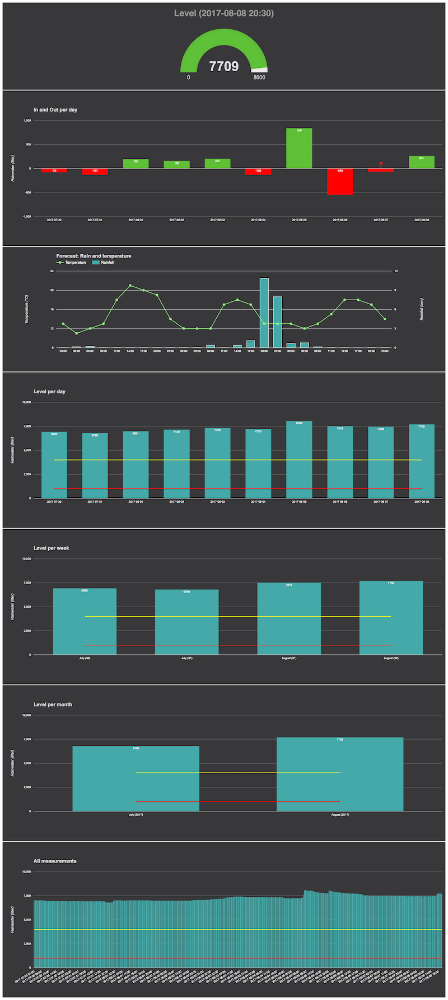

# Requirements

In general, you only need all equipment from the shopping list and a server running [Docker Compose](https://docs.docker.com/compose/).

If you want to use an external machine as web server, you need to set up a [FTP server](https://en.wikipedia.org/wiki/File_Transfer_Protocol) as well to upload the CSV data file to.
A much better way is to use [RSYNC](https://en.wikipedia.org/wiki/Rsync).

#### Shopping list:
Before you can start, you need to buy some equipment.

- [Raspberry Pi 3 Model B](https://www.amazon.de/gp/product/B01CD5VC92/ref=as_li_tl?ie=UTF8&camp=1638&creative=6742&creativeASIN=B01CD5VC92&linkCode=as2&tag=andrblog-21&linkId=72c63eb215b1264d19123010fcb213c7)
- [Ultrasonic Sensor Modul HC-SR04 Distance Sensor](https://www.amazon.de/gp/product/B00R2U8HK6/ref=as_li_tl?ie=UTF8&camp=1638&creative=6742&creativeASIN=B00R2U8HK6&linkCode=as2&tag=andrblog-21&linkId=7788b16d79176f62aafe4ab0f6e0b68b)
- [Power Supply](https://www.amazon.de/gp/product/B01E75SB2C/ref=as_li_tl?ie=UTF8&camp=1638&creative=6742&creativeASIN=B01E75SB2C&linkCode=as2&tag=andrblog-21&linkId=3f62a7a5e0ee27436a43fc5f1dd4e859)
- [Water Resistence Box](https://www.amazon.de/gp/product/B00A0J1TJW/ref=as_li_tl?ie=UTF8&camp=1638&creative=6742&creativeASIN=B00A0J1TJW&linkCode=as2&tag=andrblog-21&linkId=3ed7559fa7ebd3af453ce37ffadcb240)
- [Junction box](https://www.amazon.de/Spelsberg-Abzweigdose-Mini-25-31090801/dp/B000UW5FLW/ref=as_li_ss_tl?ie=UTF8&qid=1501701150&sr=8-18&keywords=verbindungsdose&linkCode=ll1&tag=andrblog-21&linkId=00b928948c642e643d4713cab7ed16d4)
- [Jumper Cable](https://www.amazon.de/Aukru-jumper-wire-Steckbr%C3%BCcken-Drahtbr%C3%BCcken/dp/B00MWMEIF2/ref=as_li_ss_tl?ie=UTF8&qid=1501701409&sr=8-1&keywords=jumper+kabel+male+female&linkCode=ll1&tag=andrblog-21&linkId=fe54b88fbb1a0872d65caa5de9eea74d)

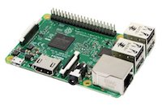
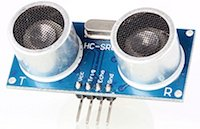
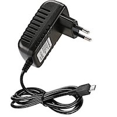

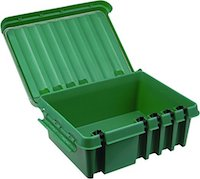
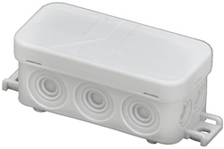
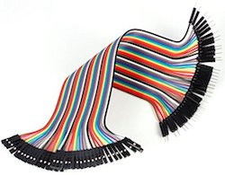

## Installing

#### Hardware

Yes, you need some low level prior knowledge regarding Raspberry Pi to get this working.
The documentation on [raspberrypi.org](https://www.raspberrypi.org/help/), [GPIO: RASPBERRY PI MODEL B](https://www.raspberrypi.org/documentation/usage/gpio/README.md) or [Google](http://google.com) will help you!

I have used PIN 11 (trigger) and PIN 13 (echo) on the Raspberry Pi for wirering the ultrasonic sensor. If you want to use other PINs you can define it at the top of the Python ([bin/scan.py](bin/scan.py)) script.

    GPIO_pin_allocation_trigger=11
    GPIO_pin_allocation_echo=13
    
Make sure that no water can get into the case of the Ultrasonic Sensor and the Raspberry Pi. I have used a [Water Resistence Box](https://www.amazon.de/gp/product/B00A0J1TJW/ref=as_li_tl?ie=UTF8&camp=1638&creative=6742&creativeASIN=B00A0J1TJW&linkCode=as2&tag=andrblog-21&linkId=3ed7559fa7ebd3af453ce37ffadcb240) and a [Junction Box](https://www.amazon.de/Spelsberg-Abzweigdose-Mini-25-31090801/dp/B000UW5FLW/ref=as_li_ss_tl?ie=UTF8&qid=1501701150&sr=8-18&keywords=verbindungsdose&linkCode=ll1&tag=andrblog-21&linkId=00b928948c642e643d4713cab7ed16d4) which works very well.

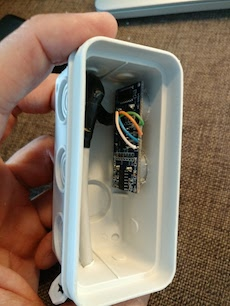
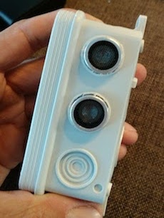

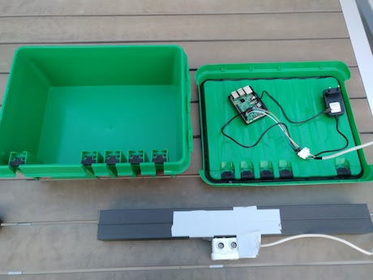

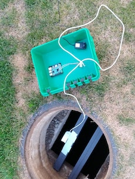
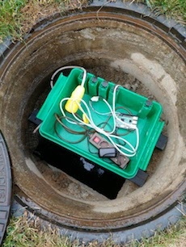

#### Software

##### Setup OS on your Raspberry

First of all install the OS [Raspbian](https://www.raspberrypi.org/downloads/raspbian/) to your Raspberry Pi and decide how to connect your Raspberry Pi to your network. The easiest way is to use an ethernet cable or you can set up [Wifi](https://www.raspberrypi.org/documentation/configuration/wireless/wireless-cli.md)  which is more comfortable regarding not to lay an extra cable.

##### Setup web server

Checkout this repository to your web server.
Start your docker container with `docker-compose up`

##### Setup raspberry pi 

Checkout this repository to your raspberry pi.

Schedule the Python script ([bin/scan.py](bin/scan.py)) in the crontab `0,30 * * * * /usr/bin/perl PATH_TO/bin/scan.py` which will scan the water gauge level every 30 minutes.

##### Setup Python script
Check the first part of the [bin/scan.py](bin/scan.py) script and set the correct settings depending on your cistern and your FTP configuration.

	distance_sensor_to_ground=230
	cistern_radius=112.5
	csv_file_path='/var/www/raspberry_gauge/var/raspberry/cistern.csv'
	ftp_host=''
	ftp_user=''
	ftp_password=''

That's it. Have fun!

# Contributing
I'm far from being an expert and suspect there are many ways to improve – if you have ideas on how to make the things easier to maintain (and faster), don't hesitate to fork and send pull requests!

# References
- [Google Charts](https://developers.google.com/chart/)
- [JustGauge](http://justgage.com/)
- [openweathermap.org](https://openweathermap.org)
- [NGINX](https://www.nginx.com/)
- [PHP](http://php.net/manual/en/intro-whatis.php)
- [Symfony](http://symfony.com/)
- [vsftp](https://en.wikipedia.org/wiki/Vsftpd)
- [getcomposer.org](https://getcomposer.org/download/)
- [RSYNC](https://en.wikipedia.org/wiki/Rsync)
- [FTP server](https://en.wikipedia.org/wiki/File_Transfer_Protocol)
- [Raspberry Pi :: Wifi](https://www.raspberrypi.org/documentation/configuration/wireless/wireless-cli.md)
- [Raspberry Pi :: Raspbian](https://www.raspberrypi.org/downloads/raspbian/)
- [raspberrypi.org](https://www.raspberrypi.org/help/)
- [Raspberry Pi :: GPIO: RASPBERRY PI MODEL B](https://www.raspberrypi.org/documentation/usage/gpio/README.md)

# Licenses
This project is released under the [MIT License](https://opensource.org/licenses/mit-license.php).

## Third party software
- [JustGauge](http://justgage.com/) ([MIT License](https://opensource.org/licenses/mit-license.php))
- [Google Charts](https://developers.google.com/chart/) ([Creative Commons Attribution 3.0 License](http://creativecommons.org/licenses/by/3.0/)).
